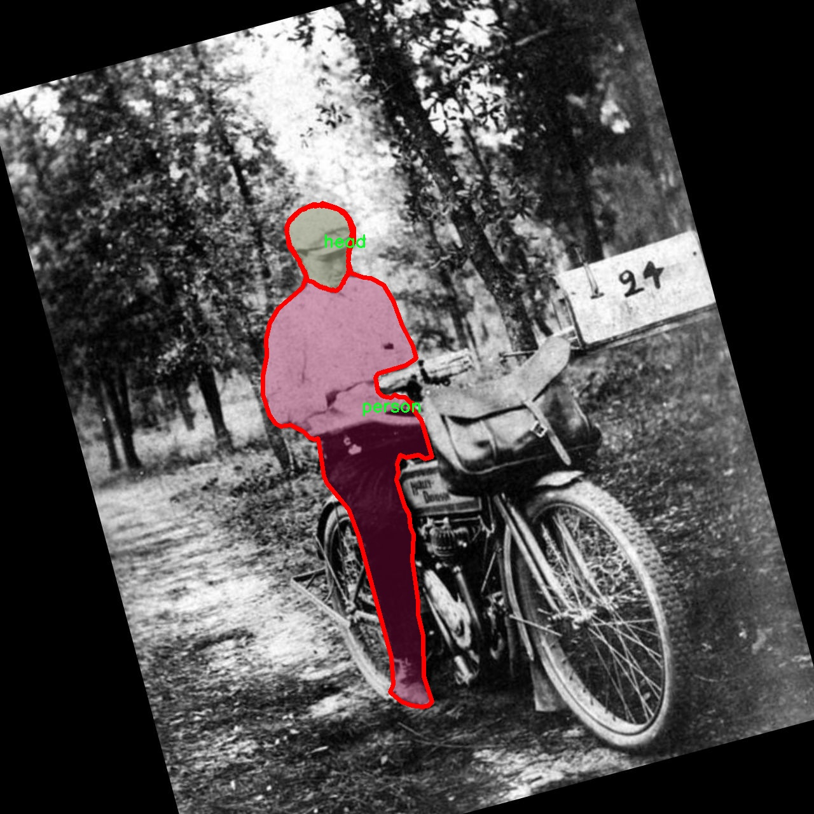

# 安全帽与人员识别分割系统源码＆数据集分享
 [yolov8-seg-C2f-DLKA＆yolov8-seg-C2f-EMSCP等50+全套改进创新点发刊_一键训练教程_Web前端展示]

### 1.研究背景与意义

项目参考[ILSVRC ImageNet Large Scale Visual Recognition Challenge](https://gitee.com/YOLOv8_YOLOv11_Segmentation_Studio/projects)

项目来源[AAAI Global Al lnnovation Contest](https://kdocs.cn/l/cszuIiCKVNis)

研究背景与意义

随着工业化进程的加快，安全生产问题日益凸显，尤其是在建筑、矿山等高危行业，工人的安全防护显得尤为重要。安全帽作为工人安全防护的基本装备之一，其佩戴情况直接关系到工人的生命安全。因此，针对安全帽的识别与监测成为了保障工人安全的重要手段。近年来，计算机视觉技术的快速发展为安全帽的自动识别提供了新的解决方案，尤其是基于深度学习的目标检测与分割技术，已被广泛应用于各类安全监测系统中。

YOLO（You Only Look Once）系列模型因其高效的实时检测能力而受到广泛关注。YOLOv8作为该系列的最新版本，具备更强的特征提取能力和更高的检测精度，适合于复杂场景下的目标识别任务。然而，传统的YOLOv8模型在处理小目标和复杂背景时仍存在一定的局限性。因此，针对YOLOv8进行改进，以提高其在安全帽与人员识别分割任务中的表现，具有重要的理论和实践意义。

本研究基于改进YOLOv8模型，构建一个安全帽与人员识别分割系统，旨在实现对工人佩戴安全帽情况的实时监测与分析。为此，我们使用了一个包含2100张图像的数据集，该数据集涵盖了四个类别：头部、头盔、人员和手机。这些类别的设置不仅可以帮助我们识别工人是否佩戴安全帽，还能进一步分析工人在工作环境中是否存在使用手机等潜在的安全隐患。通过对这些信息的提取与分析，我们能够为安全管理提供数据支持，进而降低事故发生率。

此外，研究的意义还体现在对工人行为的实时监控上。通过对人员佩戴安全帽情况的自动识别，我们可以及时发现未佩戴安全帽的工人，并通过系统发出警报，从而有效减少安全隐患。这种智能化的监测手段，不仅提高了安全管理的效率，也为工人的安全保障提供了有力的技术支持。

综上所述，基于改进YOLOv8的安全帽与人员识别分割系统的研究，不仅在技术上具有创新性，也在实际应用中具有重要的社会价值。通过提升安全帽识别的准确性和实时性，我们能够为工人创造一个更加安全的工作环境，推动安全生产管理的智能化发展，最终实现更高水平的安全保障。这一研究不仅对当前的安全管理实践具有指导意义，也为未来的智能监测系统提供了可借鉴的思路与方法。

### 2.图片演示


##### 注意：由于此博客编辑较早，上面“2.图片演示”和“3.视频演示”展示的系统图片或者视频可能为老版本，新版本在老版本的基础上升级如下：（实际效果以升级的新版本为准）

  （1）适配了YOLOV8的“目标检测”模型和“实例分割”模型，通过加载相应的权重（.pt）文件即可自适应加载模型。

  （2）支持“图片识别”、“视频识别”、“摄像头实时识别”三种识别模式。

  （3）支持“图片识别”、“视频识别”、“摄像头实时识别”三种识别结果保存导出，解决手动导出（容易卡顿出现爆内存）存在的问题，识别完自动保存结果并导出到tempDir中。

  （4）支持Web前端系统中的标题、背景图等自定义修改，后面提供修改教程。

  另外本项目提供训练的数据集和训练教程,暂不提供权重文件（best.pt）,需要您按照教程进行训练后实现图片演示和Web前端界面演示的效果。

### 3.视频演示

[3.1 视频演示](https://www.bilibili.com/video/BV1Uiy7Y7EnB/)

### 4.数据集信息展示

##### 4.1 本项目数据集详细数据（类别数＆类别名）

nc: 4
names: ['head', 'helmet', 'person', 'phone']


##### 4.2 本项目数据集信息介绍

数据集信息展示

在现代安全管理和监控系统中，针对工地及其他高风险环境中人员的安全帽与人员识别显得尤为重要。为此，我们构建了一个名为“union-phone”的数据集，旨在为改进YOLOv8-seg模型提供高质量的训练数据。该数据集专注于四个主要类别：头部（head）、安全帽（helmet）、人员（person）和手机（phone），共计四个类别。这些类别的选择不仅反映了在安全监控中需要重点关注的对象，同时也为模型的训练提供了多样化的场景和条件。

“union-phone”数据集的构建过程中，我们注重数据的多样性和真实性。数据集中的图像来源于不同的工作环境，包括建筑工地、制造车间和户外活动场所，确保模型能够在各种实际应用场景中有效识别和分割目标对象。每个类别的样本均经过精心挑选和标注，以确保其在不同光照、角度和遮挡条件下的表现。

在类别“头部”中，我们收集了大量展示人头部特征的图像，这些图像不仅包括裸露的头部，还涵盖了佩戴安全帽的情况。通过这种方式，模型能够学习到头部在不同情况下的特征，从而提高其识别准确性。对于“安全帽”类别，我们的图像数据涵盖了多种颜色和样式的安全帽，确保模型能够适应不同的行业标准和个人偏好。

“人员”类别则包含了多种姿态和活动状态下的人物图像，这些图像不仅展示了全身，还包括了部分身体的特写。这种多样性使得模型在识别人员时，能够更好地应对各种复杂的场景，如多人聚集、人员走动等情况。此外，我们还特别关注了“手机”这一类别，随着智能手机的普及，许多工人在工作时也可能会使用手机，因此在数据集中加入这一类别，有助于模型更全面地理解工作环境中的潜在风险。

数据集的标注工作采用了专业的标注工具，确保每个类别的边界框和分割区域都准确无误。标注团队由经验丰富的人员组成，他们对每个类别的特征有深入的理解，能够确保数据集的高质量。为了进一步增强数据集的有效性，我们还进行了数据增强处理，包括旋转、缩放、裁剪和颜色调整等操作，这些技术能够有效提升模型的泛化能力。

总之，“union-phone”数据集不仅为改进YOLOv8-seg的安全帽与人员识别分割系统提供了丰富的训练数据，还为后续的研究和应用奠定了坚实的基础。通过精心设计的类别结构和多样化的样本选择，该数据集旨在提升模型在实际应用中的表现，为安全管理提供更为可靠的技术支持。





### 5.全套项目环境部署视频教程（零基础手把手教学）

[5.1 环境部署教程链接（零基础手把手教学）](https://www.bilibili.com/video/BV1jG4Ve4E9t/?vd_source=bc9aec86d164b67a7004b996143742dc)


[5.2 安装Python虚拟环境创建和依赖库安装视频教程链接（零基础手把手教学）](https://www.bilibili.com/video/BV1nA4VeYEze/?vd_source=bc9aec86d164b67a7004b996143742dc)

### 6.手把手YOLOV8-seg训练视频教程（零基础小白有手就能学会）

[6.1 手把手YOLOV8-seg训练视频教程（零基础小白有手就能学会）](https://www.bilibili.com/video/BV1cA4VeYETe/?vd_source=bc9aec86d164b67a7004b996143742dc)


按照上面的训练视频教程链接加载项目提供的数据集，运行train.py即可开始训练



     Epoch   gpu_mem       box       obj       cls    labels  img_size
     1/200     0G   0.01576   0.01955  0.007536        22      1280: 100%|██████████| 849/849 [14:42<00:00,  1.04s/it]
               Class     Images     Labels          P          R     mAP@.5 mAP@.5:.95: 100%|██████████| 213/213 [01:14<00:00,  2.87it/s]
                 all       3395      17314      0.994      0.957      0.0957      0.0843

     Epoch   gpu_mem       box       obj       cls    labels  img_size
     2/200     0G   0.01578   0.01923  0.007006        22      1280: 100%|██████████| 849/849 [14:44<00:00,  1.04s/it]
               Class     Images     Labels          P          R     mAP@.5 mAP@.5:.95: 100%|██████████| 213/213 [01:12<00:00,  2.95it/s]
                 all       3395      17314      0.996      0.956      0.0957      0.0845

     Epoch   gpu_mem       box       obj       cls    labels  img_size
     3/200     0G   0.01561    0.0191  0.006895        27      1280: 100%|██████████| 849/849 [10:56<00:00,  1.29it/s]
               Class     Images     Labels          P          R     mAP@.5 mAP@.5:.95: 100%|███████   | 187/213 [00:52<00:00,  4.04it/s]
                 all       3395      17314      0.996      0.957      0.0957      0.0845


### 7.50+种全套YOLOV8-seg创新点代码加载调参视频教程（一键加载写好的改进模型的配置文件）

[7.1 50+种全套YOLOV8-seg创新点代码加载调参视频教程（一键加载写好的改进模型的配置文件）](https://www.bilibili.com/video/BV1Hw4VePEXv/?vd_source=bc9aec86d164b67a7004b996143742dc)

### 8.YOLOV8-seg图像分割算法原理

原始YOLOv8-seg算法原理

YOLOv8-seg算法是YOLO系列目标检测模型的最新进展，旨在通过更高效的特征提取和融合机制，提升目标检测的精度和速度。相较于前代模型，YOLOv8-seg在网络结构上进行了多项创新，尤其是在轻量化设计和特征融合方面的优化，使其在实际应用中展现出更强的适应性和灵活性。

首先，YOLOv8-seg的核心在于其骨干网络的设计。该模型采用了C2F模块替代了YOLOv5中的C3模块，C2F模块通过更轻量化的结构实现了特征提取的高效性。具体而言，C2F模块将卷积操作简化为3×3的卷积核，并通过深度卷积的方式来降低计算复杂度。这种设计不仅减小了模型的参数量，还在保持特征提取能力的同时，加快了计算速度。此外，YOLOv8-seg的主干网络使用了CSP（Cross Stage Partial）结构，将特征提取过程分为两部分，分别进行卷积和连接，这种分离式的设计有效地提升了特征的表达能力。

在特征融合层，YOLOv8-seg引入了BiFPN（Bidirectional Feature Pyramid Network）网络，这一创新使得模型能够在不同尺度的特征之间进行高效的双向连接和加权融合。BiFPN的设计理念在于通过删除单输入对应的节点，并在同一层的输入输出节点之间添加连接，从而实现特征信息的高效整合。这种结构不仅提升了模型对多尺度特征的提取能力，还加快了特征融合的速度，进而提高了整体的检测性能。

YOLOv8-seg的检测头部分则采用了解耦头结构，这一设计的核心在于将目标检测任务中的不同输出分开处理，从而使得模型能够更灵活地适应不同类型的目标。这种解耦的方式相较于传统的耦合头结构，能够更好地处理复杂场景下的目标检测问题，尤其是在目标重叠和背景复杂的情况下，解耦头能够有效减少误检和漏检的发生。

在损失函数的设计上，YOLOv8-seg使用了CloU（Class Loss with Uncertainty）损失函数，这一损失函数通过引入不确定性因素，使得模型在训练过程中能够更好地平衡不同类别之间的损失，从而提升了模型的泛化能力。CloU损失函数的引入，使得YOLOv8-seg在面对多样化的目标时，能够更准确地进行分类和定位。

YOLOv8-seg还具有良好的可扩展性和适应性，支持自定义数据集的训练，使得用户能够根据具体的应用场景进行模型的调整和优化。通过设置depth_factor、width_factor和ratio等参数，用户可以灵活地调整模型的深度、宽度和通道数，从而在不同的硬件环境下实现最佳的性能表现。这种灵活性使得YOLOv8-seg在工业界和学术界都得到了广泛的应用。

综上所述，YOLOv8-seg算法通过一系列的结构优化和创新设计，在目标检测领域中实现了更高的精度和更快的推理速度。其轻量化的特征提取模块、双向特征融合机制、解耦的检测头结构以及灵活的损失函数设计，使得YOLOv8-seg在处理复杂场景和多样化目标时，展现出了卓越的性能。这些特性不仅使得YOLOv8-seg成为当前目标检测领域的领先模型之一，也为未来的研究和应用提供了新的思路和方向。随着YOLOv8-seg的不断发展和完善，我们有理由相信，它将在更广泛的领域中发挥重要作用，推动目标检测技术的进一步进步。


### 9.系统功能展示（检测对象为举例，实际内容以本项目数据集为准）

图9.1.系统支持检测结果表格显示

  图9.2.系统支持置信度和IOU阈值手动调节

  图9.3.系统支持自定义加载权重文件best.pt(需要你通过步骤5中训练获得)

  图9.4.系统支持摄像头实时识别

  图9.5.系统支持图片识别

  图9.6.系统支持视频识别

  图9.7.系统支持识别结果文件自动保存

  图9.8.系统支持Excel导出检测结果数据


### 10.50+种全套YOLOV8-seg创新点原理讲解（非科班也可以轻松写刊发刊，V11版本正在科研待更新）

#### 10.1 由于篇幅限制，每个创新点的具体原理讲解就不一一展开，具体见下列网址中的创新点对应子项目的技术原理博客网址【Blog】：


[10.1 50+种全套YOLOV8-seg创新点原理讲解链接](https://gitee.com/qunmasj/good)

#### 10.2 部分改进模块原理讲解(完整的改进原理见上图和技术博客链接)【如果此小节的图加载失败可以通过CSDN或者Github搜索该博客的标题访问原始博客，原始博客图片显示正常】
### YOLOv8简介
YOLOv8 尚未发表论文，因此我们无法直接了解其创建过程中进行的直接研究方法和消融研究。话虽如此，我们分析了有关模型的存储库和可用信息，以开始记录 YOLOv8 中的新功能。

如果您想自己查看代码，请查看YOLOv8 存储库并查看此代码差异以了解一些研究是如何完成的。

在这里，我们提供了有影响力的模型更新的快速总结，然后我们将查看模型的评估，这不言自明。

GitHub 用户 RangeKing 制作的下图显示了网络架构的详细可视化。


在这里插入图片描述


在这里插入图片描述

YOLOv8 架构，GitHub 用户 RangeKing 制作的可视化

无锚检测
YOLOv8 是一个无锚模型。这意味着它直接预测对象的中心而不是已知锚框的偏移量。


YOLO中anchor box的可视化

锚框是早期 YOLO 模型中众所周知的棘手部分，因为它们可能代表目标基准框的分布，而不是自定义数据集的分布。


YOLOv8 的检测头，在netron.app中可视化

Anchor free 检测减少了框预测的数量，从而加速了非最大抑制 (NMS)，这是一个复杂的后处理步骤，在推理后筛选候选检测。


YOLOv8 的检测头，在netron.app中可视化

新的卷积
stem 的第一个6x6conv 被替换为 a 3x3，主要构建块被更改，并且C2f替换了C3。该模块总结如下图，其中“f”是特征数，“e”是扩展率，CBS是由a Conv、a BatchNorm、a组成的block SiLU。

在中， （两个具有剩余连接的 3x3C2f的奇特名称）的所有输出都被连接起来。而在仅使用最后一个输出。Bottleneck``convs``C3``Bottleneck


新的 YOLOv8C2f模块

这Bottleneck与 YOLOv5 中的相同，但第一个 conv 的内核大小从更改1x1为3x3. 从这些信息中，我们可以看到 YOLOv8 开始恢复到 2015 年定义的 ResNet 块。

在颈部，特征直接连接而不强制使用相同的通道尺寸。这减少了参数数量和张量的整体大小。

### 空间和通道重建卷积SCConv
参考该博客提出的一种高效的卷积模块，称为SCConv (spatial and channel reconstruction convolution)，以减少冗余计算并促进代表性特征的学习。提出的SCConv由空间重构单元(SRU)和信道重构单元(CRU)两个单元组成。

（1）SRU根据权重分离冗余特征并进行重构，以抑制空间维度上的冗余，增强特征的表征。

（2）CRU采用分裂变换和融合策略来减少信道维度的冗余以及计算成本和存储。

（3）SCConv是一种即插即用的架构单元，可直接用于替代各种卷积神经网络中的标准卷积。实验结果表明，scconvo嵌入模型能够通过减少冗余特征来获得更好的性能，并且显著降低了复杂度和计算成本。


SCConv如图所示，它由两个单元组成，空间重建单元(SRU)和通道重建单元(CRU)，以顺序的方式放置。具体而言，对于瓶颈残差块中的中间输入特征X，首先通过SRU运算获得空间细化特征Xw，然后利用CRU运算获得信道细化特征Y。SCConv模块充分利用了特征之间的空间冗余和通道冗余，可以无缝集成到任何CNN架构中，以减少中间特征映射之间的冗余并增强CNN的特征表示。

#### SRU单元用于空间冗余


为了利用特征的空间冗余，引入了空间重构单元(SRU)，如图2所示，它利用了分离和重构操作。

分离操作 的目的是将信息丰富的特征图与空间内容对应的信息较少的特征图分离开来。我们利用组归一化(GN)层中的比例因子来评估不同特征图的信息内容。具体来说，给定一个中间特征映射X∈R N×C×H×W，首先通过减去平均值µ并除以标准差σ来标准化输入特征X，如下所示:


其中µ和σ是X的均值和标准差，ε是为了除法稳定性而加入的一个小的正常数，γ和β是可训练的仿射变换。

GN层中的可训练参数\gamma \in R^{C}用于测量每个批次和通道的空间像素方差。更丰富的空间信息反映了空间像素的更多变化，从而导致更大的γ。归一化相关权重W_{\gamma} \in R^{C}由下面公式2得到，表示不同特征映射的重要性。


然后将经Wγ重新加权的特征映射的权值通过sigmoid函数映射到(0,1)范围，并通过阈值进行门控。我们将阈值以上的权重设置为1，得到信息权重W1，将其设置为0，得到非信息权重W2(实验中阈值设置为0.5)。获取W的整个过程可以用公式表示。


最后将输入特征X分别乘以W1和W2，得到两个加权特征:信息量较大的特征X_{1}^{\omega }和信息量较小的特征X_{2}^{\omega }。这样就成功地将输入特征分为两部分:X_{1}^{\omega }具有信息量和表达性的空间内容，而X_{2}^{\omega }几乎没有信息，被认为是冗余的。

重构操作 将信息丰富的特征与信息较少的特征相加，生成信息更丰富的特征，从而节省空间空间。采用交叉重构运算，将加权后的两个不同的信息特征充分结合起来，加强它们之间的信息流。然后将交叉重构的特征X^{\omega1}和X^{\omega2}进行拼接，得到空间精细特征映射X^{\omega}。从后过程表示如下：


其中⊗是逐元素的乘法，⊕是逐元素的求和，∪是串联。将SRU应用于中间输入特征X后，不仅将信息特征与信息较少的特征分离，而且对其进行重构，增强代表性特征，抑制空间维度上的冗余特征。然而，空间精细特征映射X^{\omega}在通道维度上仍然是冗余的。

#### CRU单元用于通道冗余


分割 操作将输入的空间细化特征X^{\omega}分割成两个部分，一部分通道数是\alpha C，另一部分通道数是(1-\alpha) C，随后对两组特征的通道数使用1 * 1卷积核进行压缩，分别得到X_{up}和X_{low}。

转换 操作将输入的X_{up}作为“富特征提取”的输入，分别进行GWC和PWC，然后相加得到输出Y1，将输入X_{low}作为“富特征提取”的补充，进行PWC，得到的记过和原来的输入取并集得到Y2。

融合 操作使用简化的SKNet方法来自适应合并Y1和Y2。具体说是首先使用全局平均池化将全局空间信息和通道统计信息结合起来，得到经过池化的S1和S2。然后对S1和S2做Softmax得到特征权重向量\beta _{1}和\beta _{2}，最后使用特征权重向量得到输出Y = \beta _{1}*Y_{1} + \beta _{2}*Y_{2}，Y即为通道提炼的特征。


### 11.项目核心源码讲解（再也不用担心看不懂代码逻辑）

#### 11.1 ultralytics\nn\extra_modules\ops_dcnv3\functions\__init__.py

以下是对给定代码的核心部分进行提炼和详细注释的结果：

```python
# --------------------------------------------------------
# InternImage
# 版权所有 (c) 2022 OpenGVLab
# 根据 MIT 许可证授权 [详细信息见 LICENSE]
# --------------------------------------------------------

# 从当前包中导入 DCNv3Function 和 dcnv3_core_pytorch 模块
from .dcnv3_func import DCNv3Function, dcnv3_core_pytorch

# DCNv3Function：这是一个自定义的深度可分离卷积（Deformable Convolution）函数，
# 用于实现更灵活的卷积操作，能够适应输入特征图的形状变化。

# dcnv3_core_pytorch：这是与 DCNv3Function 相关的核心功能实现，可能包含
# 对 PyTorch 框架的特定优化和支持，以提高模型的性能和效率。
```

### 代码分析
1. **版权信息**：代码开头包含版权声明和许可证信息，表明该代码是由 OpenGVLab 开发的，并且遵循 MIT 许可证。
2. **模块导入**：使用 `from .dcnv3_func import ...` 语句从同一包中导入了两个核心功能模块。这种导入方式表明这两个功能可能是该包的核心实现部分。
3. **功能说明**：
   - `DCNv3Function` 是一个自定义函数，通常用于实现可变形卷积，这种卷积方式能够根据输入数据的特征动态调整卷积核的位置和形状，从而提高模型的表达能力。
   - `dcnv3_core_pytorch` 可能包含了与 PyTorch 相关的底层实现，确保 `DCNv3Function` 能够高效地在 PyTorch 框架中运行。

以上是对代码的核心部分和功能的详细注释与分析。

这个文件是一个Python模块的初始化文件，位于`ultralytics/nn/extra_modules/ops_dcnv3/functions/`目录下。它的主要作用是导入其他模块中的功能，以便在当前模块中使用。

文件开头的注释部分包含了版权信息，表明该代码是由OpenGVLab于2022年开发的，并且它遵循MIT许可证。这种许可证允许用户自由使用、复制和修改代码，只要在使用时遵循许可证的条款。

接下来的代码行通过`from .dcnv3_func import DCNv3Function, dcnv3_core_pytorch`导入了`dcnv3_func`模块中的两个对象：`DCNv3Function`和`dcnv3_core_pytorch`。前面的点（`.`）表示这是一个相对导入，意味着`dcnv3_func`模块与当前模块在同一目录下。

`DCNv3Function`和`dcnv3_core_pytorch`可能是与DCN（Deformable Convolutional Networks）相关的功能或类，DCN是一种用于提高卷积神经网络（CNN）性能的技术，能够处理形变和不规则的输入数据。通过将这些功能导入到当前模块，用户可以方便地使用这些功能进行深度学习模型的构建和训练。

总的来说，这个初始化文件的作用是将特定的功能模块引入到当前命名空间中，以便在更大的项目中进行使用。

#### 11.2 ui.py

以下是代码中最核心的部分，并附上详细的中文注释：

```python
import sys
import subprocess

def run_script(script_path):
    """
    使用当前 Python 环境运行指定的脚本。

    Args:
        script_path (str): 要运行的脚本路径

    Returns:
        None
    """
    # 获取当前 Python 解释器的路径
    python_path = sys.executable

    # 构建运行命令，使用 streamlit 运行指定的脚本
    command = f'"{python_path}" -m streamlit run "{script_path}"'

    # 执行命令
    result = subprocess.run(command, shell=True)
    # 检查命令执行结果，如果返回码不为0，表示出错
    if result.returncode != 0:
        print("脚本运行出错。")

# 实例化并运行应用
if __name__ == "__main__":
    # 指定要运行的脚本路径
    script_path = "web.py"  # 这里可以直接指定脚本名称

    # 调用函数运行脚本
    run_script(script_path)
```

### 代码说明：
1. **导入模块**：
   - `sys`：用于访问与 Python 解释器相关的变量和函数。
   - `subprocess`：用于执行外部命令。

2. **定义 `run_script` 函数**：
   - 该函数接收一个脚本路径作为参数，并使用当前 Python 环境运行该脚本。
   - `sys.executable` 获取当前 Python 解释器的路径，以确保使用正确的 Python 环境。
   - 使用 `subprocess.run` 执行构建的命令，并检查命令的返回码以判断脚本是否成功运行。

3. **主程序入口**：
   - 当脚本作为主程序运行时，指定要执行的脚本路径（在这里是 `web.py`）。
   - 调用 `run_script` 函数来执行指定的脚本。

这个程序文件名为 `ui.py`，其主要功能是使用当前的 Python 环境来运行一个指定的脚本。代码首先导入了必要的模块，包括 `sys`、`os` 和 `subprocess`，以及一个自定义模块 `QtFusion.path` 中的 `abs_path` 函数。

在 `run_script` 函数中，程序接受一个参数 `script_path`，这是要运行的脚本的路径。函数首先获取当前 Python 解释器的路径，这样可以确保在正确的环境中执行脚本。接着，程序构建了一个命令字符串，该命令使用 `streamlit` 模块来运行指定的脚本。`streamlit` 是一个用于构建数据应用的库。

然后，程序通过 `subprocess.run` 方法执行这个命令。这个方法会在一个新的 shell 中运行命令，并等待其完成。如果命令执行后返回的状态码不为零，说明脚本运行出错，程序会打印出相应的错误信息。

在文件的最后部分，使用 `if __name__ == "__main__":` 语句来确保当这个文件作为主程序运行时，才会执行下面的代码。这里指定了要运行的脚本路径为 `web.py`，并调用 `run_script` 函数来执行这个脚本。

总体来说，这个程序的主要目的是提供一个简单的接口，通过命令行运行一个特定的 Python 脚本，并处理可能出现的错误。

#### 11.3 ultralytics\nn\autobackend.py

以下是经过简化和注释的核心代码部分，主要保留了模型加载和推理的功能：

```python
import torch
import torch.nn as nn
from ultralytics.utils import check_requirements, yaml_load

class AutoBackend(nn.Module):
    """
    处理Ultralytics YOLO模型的动态后端选择。
    支持多种模型格式，便于在不同平台上部署。
    """

    @torch.no_grad()
    def __init__(self, weights='yolov8n.pt', device=torch.device('cpu'), fp16=False, fuse=True, data=None):
        """
        初始化AutoBackend进行推理。

        参数:
            weights (str): 模型权重文件的路径，默认为'yolov8n.pt'。
            device (torch.device): 运行模型的设备，默认为CPU。
            fp16 (bool): 启用半精度推理，默认为False。
            fuse (bool): 是否融合Conv2D和BatchNorm层以优化，默认为True。
            data (str | Path | optional): 包含类名的额外data.yaml文件的路径，默认为None。
        """
        super().__init__()
        # 确定模型类型
        model_type = self._model_type(weights)
        self.fp16 = fp16  # 是否使用半精度
        self.device = device  # 设备
        self.model = None  # 初始化模型

        # 加载模型
        if model_type[0]:  # 如果是PyTorch模型
            self.model = torch.load(weights, map_location=device)
            self.model.eval()  # 设置为评估模式
            if fp16:
                self.model.half()  # 转换为半精度

        # 其他模型格式的加载可以在这里添加...

        # 加载类名
        self.names = self._apply_default_class_names(data)

    def forward(self, im):
        """
        对输入图像进行推理。

        参数:
            im (torch.Tensor): 输入图像张量。

        返回:
            (torch.Tensor): 推理结果。
        """
        if self.fp16:
            im = im.half()  # 转换为半精度
        return self.model(im)  # 进行推理

    @staticmethod
    def _model_type(p):
        """
        确定模型文件的类型。

        参数:
            p: 模型文件的路径。
        返回:
            list: 各种模型格式的布尔值列表。
        """
        types = [p.endswith(suffix) for suffix in ['.pt', '.onnx', '.pb']]  # 检查支持的后缀
        return types

    @staticmethod
    def _apply_default_class_names(data):
        """应用默认类名或返回数字类名。"""
        return yaml_load(data)['names'] if data else {i: f'class{i}' for i in range(999)}  # 默认类名
```

### 代码说明：
1. **AutoBackend类**：这是一个处理YOLO模型的类，负责根据不同的模型格式加载和推理。
2. **`__init__`方法**：初始化类，加载模型权重并设置设备和精度。
   - `weights`参数指定模型权重文件。
   - `device`参数指定使用的设备（CPU或GPU）。
   - `fp16`参数决定是否使用半精度推理。
   - `fuse`参数决定是否融合卷积和批归一化层以优化模型。
3. **`forward`方法**：执行推理，接受输入图像并返回推理结果。
4. **`_model_type`静态方法**：根据文件后缀确定模型类型。
5. **`_apply_default_class_names`静态方法**：加载类名，如果没有提供则返回默认的类名。

该代码的核心功能是模型的加载和推理，其他格式的支持可以根据需要添加。

这个程序文件是Ultralytics YOLO模型的一个后端处理模块，主要用于动态选择和加载不同格式的模型进行推理。它的核心是`AutoBackend`类，该类封装了多种模型格式的支持，包括PyTorch、ONNX、TensorRT等。通过这个类，用户可以方便地在不同的推理引擎之间切换，而无需关心底层实现的细节。

文件开头引入了一些必要的库，包括`torch`、`cv2`、`numpy`等，这些库为模型的加载和推理提供了基础功能。接着，定义了一个`check_class_names`函数，用于检查和转换类名，确保类名符合要求并且能够映射到人类可读的格式。

`AutoBackend`类的构造函数接收多个参数，包括模型权重路径、设备类型、是否使用DNN模块、数据配置文件等。根据传入的模型权重路径，构造函数会判断模型的类型，并加载相应的模型。例如，如果是PyTorch模型，它会使用`attempt_load_weights`函数加载模型权重；如果是ONNX模型，则会使用OpenCV的DNN模块或ONNX Runtime进行加载。

在模型加载过程中，构造函数还会处理一些额外的元数据，例如模型的输入输出名称、模型的步幅、类名等。这些信息在后续的推理过程中会被用到。

`forward`方法是`AutoBackend`类的核心功能之一，它接受一个图像张量作为输入，并根据模型的类型执行推理。不同的模型格式会有不同的处理方式，例如，对于PyTorch模型，直接调用模型的`forward`方法；对于ONNX模型，则需要将输入转换为NumPy数组后再进行推理。推理结果会被处理并返回。

此外，`warmup`方法用于在模型推理之前进行预热，通过运行一次前向传播来提高后续推理的效率。`_apply_default_class_names`和`_model_type`是一些静态方法，用于处理类名和判断模型类型。

总的来说，这个文件提供了一个灵活的接口，使得用户可以轻松地加载和使用不同格式的YOLO模型进行推理，适应各种应用场景。

#### 11.4 train.py

以下是经过简化并添加详细中文注释的核心代码部分：

```python
import os
import torch
import yaml
from ultralytics import YOLO  # 导入YOLO模型库

if __name__ == '__main__':  # 确保该模块被直接运行时才执行以下代码
    # 设置训练参数
    workers = 1  # 数据加载的工作进程数
    batch = 8  # 每个批次的样本数量
    device = "0" if torch.cuda.is_available() else "cpu"  # 判断是否使用GPU

    # 获取数据集配置文件的绝对路径
    data_path = abs_path(f'datasets/data/data.yaml', path_type='current')  

    # 将路径转换为Unix风格
    unix_style_path = data_path.replace(os.sep, '/')
    # 获取目录路径
    directory_path = os.path.dirname(unix_style_path)

    # 读取YAML文件，保持原有顺序
    with open(data_path, 'r') as file:
        data = yaml.load(file, Loader=yaml.FullLoader)

    # 修改数据集路径
    if 'train' in data and 'val' in data and 'test' in data:
        data['train'] = directory_path + '/train'  # 设置训练集路径
        data['val'] = directory_path + '/val'      # 设置验证集路径
        data['test'] = directory_path + '/test'    # 设置测试集路径

        # 将修改后的数据写回YAML文件
        with open(data_path, 'w') as file:
            yaml.safe_dump(data, file, sort_keys=False)

    # 加载YOLO模型配置和预训练权重
    model = YOLO(r"C:\codeseg\codenew\50+种YOLOv8算法改进源码大全和调试加载训练教程（非必要）\改进YOLOv8模型配置文件\yolov8-seg-C2f-Faster.yaml").load("./weights/yolov8s-seg.pt")

    # 开始训练模型
    results = model.train(
        data=data_path,  # 指定训练数据的配置文件路径
        device=device,  # 指定使用的设备（GPU或CPU）
        workers=workers,  # 指定数据加载的工作进程数
        imgsz=640,  # 输入图像的大小
        epochs=100,  # 训练的轮数
        batch=batch,  # 每个批次的样本数量
    )
```

### 代码注释说明：
1. **导入必要的库**：引入了操作系统、PyTorch、YAML处理库和YOLO模型库。
2. **主程序入口**：使用`if __name__ == '__main__':`确保只有在直接运行该脚本时才执行后续代码。
3. **设置训练参数**：定义了数据加载的工作进程数、批次大小和设备选择（GPU或CPU）。
4. **数据集路径处理**：获取数据集配置文件的绝对路径，并将其转换为Unix风格的路径。
5. **读取和修改YAML文件**：读取数据集配置文件，修改训练、验证和测试集的路径，并将修改后的内容写回文件。
6. **加载YOLO模型**：指定模型配置文件和预训练权重进行模型加载。
7. **模型训练**：调用`model.train()`方法开始训练，传入必要的参数如数据路径、设备、工作进程数、图像大小、训练轮数和批次大小。

这个程序文件`train.py`的主要功能是使用YOLO（You Only Look Once）模型进行目标检测的训练。程序首先导入了一些必要的库，包括`os`、`torch`、`yaml`和`matplotlib`，并从`ultralytics`库中导入YOLO模型。接下来，程序确保只有在直接运行该模块时才会执行以下代码。

在程序的主体部分，首先设置了一些训练参数，包括工作进程数`workers`、批次大小`batch`、以及设备`device`。设备的选择是基于当前系统是否支持CUDA，如果支持则使用GPU（设备编号为0），否则使用CPU。接着，程序获取数据集配置文件的绝对路径，该文件是一个YAML格式的文件，包含了训练、验证和测试数据的路径。

程序将数据路径中的分隔符统一替换为Unix风格的斜杠，并从中提取出目录路径。随后，程序打开YAML文件并读取其内容。若文件中包含`train`、`val`和`test`的项，程序会根据目录路径更新这些项的值，并将修改后的数据写回到YAML文件中。

在模型加载部分，程序创建了一个YOLO模型实例，并加载了指定的配置文件和预训练权重。需要注意的是，不同的YOLO模型对设备的要求不同，因此如果遇到显存不足的错误，可以尝试使用其他模型进行测试。

最后，程序调用`model.train()`方法开始训练模型，传入训练数据的配置文件路径、设备、工作进程数、输入图像大小、训练的epoch数量以及批次大小等参数。这一系列操作完成后，模型便会开始进行训练，直到达到指定的epoch数量。

#### 11.5 ultralytics\nn\extra_modules\ops_dcnv3\functions\dcnv3_func.py

以下是代码中最核心的部分，并附上详细的中文注释：

```python
import torch
import torch.nn.functional as F
from torch.autograd import Function
from torch.cuda.amp import custom_bwd, custom_fwd

class DCNv3Function(Function):
    @staticmethod
    @custom_fwd
    def forward(ctx, input, offset, mask, kernel_h, kernel_w, stride_h, stride_w, pad_h, pad_w, dilation_h, dilation_w, group, group_channels, offset_scale, im2col_step, remove_center):
        # 保存卷积参数到上下文中，以便在反向传播时使用
        ctx.kernel_h = kernel_h
        ctx.kernel_w = kernel_w
        ctx.stride_h = stride_h
        ctx.stride_w = stride_w
        ctx.pad_h = pad_h
        ctx.pad_w = pad_w
        ctx.dilation_h = dilation_h
        ctx.dilation_w = dilation_w
        ctx.group = group
        ctx.group_channels = group_channels
        ctx.offset_scale = offset_scale
        ctx.im2col_step = im2col_step
        ctx.remove_center = remove_center

        # 准备传递给DCNv3前向函数的参数
        args = [input, offset, mask, kernel_h, kernel_w, stride_h, stride_w, pad_h, pad_w, dilation_h, dilation_w, group, group_channels, offset_scale, ctx.im2col_step]
        if remove_center:
            args.append(remove_center)

        # 调用DCNv3的前向函数
        output = DCNv3.dcnv3_forward(*args)
        ctx.save_for_backward(input, offset, mask)  # 保存输入以便在反向传播中使用

        return output

    @staticmethod
    @custom_bwd
    def backward(ctx, grad_output):
        # 从上下文中恢复保存的张量
        input, offset, mask = ctx.saved_tensors

        # 准备传递给DCNv3反向函数的参数
        args = [input, offset, mask, ctx.kernel_h, ctx.kernel_w, ctx.stride_h, ctx.stride_w, ctx.pad_h, ctx.pad_w, ctx.dilation_h, ctx.dilation_w, ctx.group, ctx.group_channels, ctx.offset_scale, grad_output.contiguous(), ctx.im2col_step]
        if ctx.remove_center:
            args.append(ctx.remove_center)

        # 调用DCNv3的反向函数
        grad_input, grad_offset, grad_mask = DCNv3.dcnv3_backward(*args)

        return grad_input, grad_offset, grad_mask, None, None, None, None, None, None, None, None, None, None, None, None

def dcnv3_core_pytorch(input, offset, mask, kernel_h, kernel_w, stride_h, stride_w, pad_h, pad_w, dilation_h, dilation_w, group, group_channels, offset_scale, remove_center):
    # 对输入进行填充
    input = F.pad(input, [0, 0, pad_h, pad_h, pad_w, pad_w])
    N_, H_in, W_in, _ = input.shape
    _, H_out, W_out, _ = offset.shape

    # 获取参考点和生成膨胀网格
    ref = _get_reference_points(input.shape, input.device, kernel_h, kernel_w, dilation_h, dilation_w, pad_h, pad_w, stride_h, stride_w)
    grid = _generate_dilation_grids(input.shape, kernel_h, kernel_w, dilation_h, dilation_w, group, input.device)

    # 计算采样位置
    sampling_locations = (ref + grid * offset_scale).repeat(N_, 1, 1, 1, 1)
    if remove_center:
        sampling_locations = remove_center_sampling_locations(sampling_locations, kernel_w=kernel_w, kernel_h=kernel_h)
    sampling_locations = sampling_locations.flatten(3, 4) + offset * offset_scale

    # 使用grid_sample进行采样
    input_ = input.view(N_, H_in * W_in, group * group_channels).transpose(1, 2).reshape(N_ * group, group_channels, H_in, W_in)
    sampling_input_ = F.grid_sample(input_, sampling_locations, mode='bilinear', padding_mode='zeros', align_corners=False)

    # 计算输出
    mask = mask.view(N_, H_out * W_out, group, -1).transpose(1, 2).reshape(N_ * group, 1, H_out * W_out, -1)
    output = (sampling_input_ * mask).sum(-1).view(N_, group * group_channels, H_out * W_out)

    return output.transpose(1, 2).reshape(N_, H_out, W_out, -1).contiguous()
```

### 代码核心部分解释：
1. **DCNv3Function类**：
   - 这个类定义了DCNv3的前向和反向传播过程，继承自`torch.autograd.Function`。
   - `forward`方法负责计算前向传播，接收输入、偏移量、掩码等参数，并调用DCNv3的前向实现。
   - `backward`方法负责计算反向传播，接收梯度输出，并调用DCNv3的反向实现。

2. **dcnv3_core_pytorch函数**：
   - 该函数实现了DCNv3的核心逻辑，包括输入填充、参考点和膨胀网格的生成、采样位置的计算和最终输出的生成。
   - 使用`F.grid_sample`进行双线性插值采样，结合掩码计算最终输出。

3. **辅助函数**：
   - `_get_reference_points`和`_generate_dilation_grids`等函数用于计算采样的参考点和生成膨胀网格，这些是DCNv3操作的基础。

这些核心部分构成了DCNv3的基本功能，能够在深度学习模型中实现可变形卷积操作。

这个程序文件是一个实现深度学习中可变形卷积（Deformable Convolution）操作的PyTorch扩展，主要使用了DCNv3（Deformable Convolutional Networks v3）的方法。文件中包含了自定义的前向和反向传播函数，主要用于处理输入张量的空间变形。

首先，文件导入了一些必要的库，包括PyTorch及其功能模块，并尝试导入DCNv3库以获取其版本信息。接着，定义了一个名为`DCNv3Function`的类，继承自`torch.autograd.Function`，用于实现自定义的前向和反向传播逻辑。

在`forward`静态方法中，首先将输入参数保存到上下文`ctx`中，以便在反向传播时使用。然后，构建一个参数列表并调用DCNv3的前向函数进行计算，最后将输入、偏移量和掩码保存以便在反向传播中使用，并返回输出结果。

在`backward`静态方法中，首先从上下文中恢复保存的张量，然后构建参数列表并调用DCNv3的反向函数计算梯度。返回的梯度包括输入、偏移量和掩码的梯度，其余参数返回`None`。

`symbolic`方法用于ONNX导出，返回一个DCNv3操作的符号表示，方便在模型转换时使用。

接下来，文件中定义了一些辅助函数，包括`_get_reference_points`和`_generate_dilation_grids`，用于计算参考点和膨胀网格。这些函数根据输入的空间形状、卷积核大小、膨胀率等参数生成相应的参考点和采样网格。

`remove_center_sampling_locations`函数用于移除中心采样位置，确保在某些情况下只保留有效的采样位置。

最后，`dcnv3_core_pytorch`函数实现了可变形卷积的核心逻辑。它首先对输入进行填充，然后计算参考点和采样网格，生成采样位置，并通过`F.grid_sample`函数进行双线性插值，最终根据掩码对采样结果进行加权求和，返回最终的输出。

整体来看，这个文件实现了DCNv3可变形卷积的前向和反向传播逻辑，并提供了一些辅助函数以支持复杂的空间变形操作，适用于需要处理变形卷积的深度学习模型。

#### 11.6 ultralytics\models\yolo\pose\val.py

以下是经过简化并添加详细中文注释的核心代码部分：

```python
# 导入必要的库
from ultralytics.models.yolo.detect import DetectionValidator
from ultralytics.utils import ops
from ultralytics.utils.metrics import PoseMetrics, box_iou, kpt_iou

class PoseValidator(DetectionValidator):
    """
    PoseValidator类用于基于姿态模型的验证，继承自DetectionValidator类。
    """

    def __init__(self, dataloader=None, save_dir=None, pbar=None, args=None, _callbacks=None):
        """初始化PoseValidator对象，设置自定义参数和属性。"""
        super().__init__(dataloader, save_dir, pbar, args, _callbacks)  # 调用父类构造函数
        self.sigma = None  # 初始化sigma
        self.kpt_shape = None  # 初始化关键点形状
        self.args.task = 'pose'  # 设置任务类型为姿态检测
        self.metrics = PoseMetrics(save_dir=self.save_dir)  # 初始化姿态度量对象

    def preprocess(self, batch):
        """预处理批次数据，将关键点数据转换为浮点数并移动到设备上。"""
        batch = super().preprocess(batch)  # 调用父类的预处理方法
        batch['keypoints'] = batch['keypoints'].to(self.device).float()  # 转换关键点数据类型
        return batch

    def postprocess(self, preds):
        """应用非极大值抑制，返回高置信度的检测结果。"""
        return ops.non_max_suppression(preds,
                                       self.args.conf,
                                       self.args.iou,
                                       labels=self.lb,
                                       multi_label=True,
                                       agnostic=self.args.single_cls,
                                       max_det=self.args.max_det,
                                       nc=self.nc)

    def update_metrics(self, preds, batch):
        """更新度量指标，计算预测结果与真实标签之间的匹配情况。"""
        for si, pred in enumerate(preds):  # 遍历每个预测结果
            idx = batch['batch_idx'] == si  # 获取当前批次索引
            cls = batch['cls'][idx]  # 获取当前批次的类别
            bbox = batch['bboxes'][idx]  # 获取当前批次的边界框
            kpts = batch['keypoints'][idx]  # 获取当前批次的关键点
            npr = pred.shape[0]  # 当前预测数量
            if npr == 0:  # 如果没有预测结果
                continue  # 跳过当前循环

            # 处理预测结果
            predn = pred.clone()  # 克隆预测结果
            ops.scale_boxes(batch['img'][si].shape[1:], predn[:, :4], shape)  # 将预测框缩放到原始图像大小

            # 计算IoU
            if cls.shape[0]:  # 如果有真实标签
                correct_bboxes = self._process_batch(predn[:, :6], labelsn)  # 处理边界框
                correct_kpts = self._process_batch(predn[:, :6], labelsn, pred_kpts, tkpts)  # 处理关键点

            # 更新统计信息
            self.stats.append((correct_bboxes, correct_kpts, pred[:, 4], pred[:, 5], cls.squeeze(-1)))

    def _process_batch(self, detections, labels, pred_kpts=None, gt_kpts=None):
        """
        处理批次，返回正确的预测矩阵。
        """
        if pred_kpts is not None and gt_kpts is not None:
            iou = kpt_iou(gt_kpts, pred_kpts, sigma=self.sigma)  # 计算关键点IoU
        else:
            iou = box_iou(labels[:, 1:], detections[:, :4])  # 计算边界框IoU

        return self.match_predictions(detections[:, 5], labels[:, 0], iou)  # 匹配预测结果

    def plot_val_samples(self, batch, ni):
        """绘制并保存验证集样本，包含预测的边界框和关键点。"""
        plot_images(batch['img'],
                    batch['batch_idx'],
                    batch['cls'].squeeze(-1),
                    batch['bboxes'],
                    kpts=batch['keypoints'],
                    paths=batch['im_file'],
                    fname=self.save_dir / f'val_batch{ni}_labels.jpg')

    def eval_json(self, stats):
        """使用COCO JSON格式评估目标检测模型。"""
        if self.args.save_json and len(self.jdict):
            # 评估逻辑
            pass  # 省略具体实现
        return stats  # 返回统计信息
```

### 代码说明：
1. **PoseValidator类**：继承自`DetectionValidator`，用于姿态检测的验证。
2. **初始化方法**：设置必要的参数和属性，包括任务类型和度量对象。
3. **预处理方法**：对输入批次进行预处理，将关键点数据转换为浮点数并移动到指定设备。
4. **后处理方法**：应用非极大值抑制，筛选出高置信度的检测结果。
5. **更新度量方法**：计算预测结果与真实标签之间的匹配情况，并更新统计信息。
6. **处理批次方法**：计算IoU（交并比），用于评估预测的准确性。
7. **绘制验证样本方法**：可视化验证集样本及其预测结果。
8. **评估JSON方法**：使用COCO格式评估模型性能，返回统计信息。

这个程序文件是Ultralytics YOLO（You Only Look Once）模型的一个验证模块，专门用于姿态估计（Pose Estimation）。它继承自DetectionValidator类，主要用于对姿态模型的验证和评估。

在文件的开头，导入了一些必要的库和模块，包括路径处理、NumPy、PyTorch等。接着，导入了DetectionValidator类以及一些工具函数和指标计算模块。

PoseValidator类的构造函数初始化了一些参数，包括数据加载器、保存目录、进度条、参数和回调函数。它调用了父类的构造函数，并设置了任务类型为“pose”。此外，还初始化了PoseMetrics类，用于计算姿态估计的指标。构造函数中还包含了对Apple MPS设备的警告信息，提示用户在使用姿态模型时最好选择CPU设备。

在预处理方法中，输入的批次数据被转换为浮点数并移动到指定的设备上。get_desc方法返回评估指标的描述字符串，用于打印输出。

postprocess方法应用非极大值抑制（NMS）来过滤掉低置信度的检测结果。init_metrics方法用于初始化姿态估计的指标，判断输入的关键点形状是否符合预期，并设置相应的sigma值。

update_metrics方法是更新指标的核心部分。它处理每个预测结果，计算正确的关键点和边界框，并更新统计信息。如果启用了保存JSON的选项，还会将预测结果保存为JSON格式。

_process_batch方法用于返回正确的预测矩阵，计算预测框和真实框之间的交并比（IoU），并根据IoU匹配预测和标签。plot_val_samples和plot_predictions方法用于可视化验证样本和预测结果，分别绘制真实框和预测框。

pred_to_json方法将YOLO的预测结果转换为COCO格式的JSON，便于后续评估。eval_json方法则使用COCO格式的JSON评估模型的性能，计算mAP（平均精度均值）等指标，并输出评估结果。

整体而言，这个文件实现了姿态估计模型的验证流程，包括数据预处理、指标计算、结果可视化和评估，具有较为完整的功能。

### 12.系统整体结构（节选）

### 程序整体功能和构架概括

该程序是一个基于Ultralytics YOLO框架的深度学习项目，主要用于目标检测和姿态估计。程序的整体架构包括多个模块，每个模块负责特定的功能，如模型训练、验证、推理、数据处理和可视化等。以下是各个模块的主要功能：

- **模型训练**：`train.py`负责训练YOLO模型，支持多种数据集配置和模型格式。
- **模型验证**：`val.py`用于评估姿态估计模型的性能，计算指标并可视化结果。
- **模型后端**：`autobackend.py`动态选择和加载不同格式的模型进行推理。
- **可变形卷积**：`dcnv3_func.py`实现了DCNv3可变形卷积的前向和反向传播逻辑。
- **用户界面**：`ui.py`提供了一个简单的命令行界面，用于运行指定的脚本。
- **模块初始化**：`__init__.py`文件用于初始化包，并导入相关功能。
- **匹配工具**：`matching.py`实现了目标匹配的算法。
- **分布式训练**：`dist.py`提供了分布式训练的工具函数。
- **解码器模块**：`decoders.py`实现了SAM（Segment Anything Model）模型的解码功能。
- **视频测试**：`demo_test_video.py`用于在视频上演示模型的推理效果。
- **构建模块**：`build.py`用于构建SAM模型的各个组件。
- **可视化工具**：`plotting.py`提供了可视化模型结果的功能。

### 文件功能整理表

| 文件路径                                                 | 功能描述                                           |
|--------------------------------------------------------|--------------------------------------------------|
| `ultralytics/nn/extra_modules/ops_dcnv3/functions/__init__.py` | 初始化DCNv3可变形卷积模块，导入相关功能               |
| `ui.py`                                               | 提供命令行界面，用于运行指定的Python脚本               |
| `__init__.py`                                        | 初始化包，导入相关模块和功能                          |
| `ultralytics/nn/autobackend.py`                     | 动态选择和加载不同格式的YOLO模型进行推理             |
| `train.py`                                          | 负责训练YOLO模型，支持多种数据集配置和模型格式        |
| `ultralytics/nn/extra_modules/ops_dcnv3/functions/dcnv3_func.py` | 实现DCNv3可变形卷积的前向和反向传播逻辑                |
| `ultralytics/models/yolo/pose/val.py`               | 验证姿态估计模型的性能，计算指标并可视化结果            |
| `ultralytics/trackers/utils/matching.py`            | 实现目标匹配算法                                     |
| `ultralytics/utils/dist.py`                          | 提供分布式训练的工具函数                             |
| `ultralytics/models/sam/modules/decoders.py`        | 实现SAM模型的解码功能                                |
| `demo_test_video.py`                                 | 在视频上演示模型的推理效果                           |
| `ultralytics/models/sam/build.py`                    | 构建SAM模型的各个组件                                |
| `ultralytics/utils/plotting.py`                      | 提供可视化模型结果的功能                             |

以上表格整理了每个文件的功能，帮助理解整个项目的结构和各个模块之间的关系。

注意：由于此博客编辑较早，上面“11.项目核心源码讲解（再也不用担心看不懂代码逻辑）”中部分代码可能会优化升级，仅供参考学习，完整“训练源码”、“Web前端界面”和“50+种创新点源码”以“14.完整训练+Web前端界面+50+种创新点源码、数据集获取”的内容为准。

### 13.图片、视频、摄像头图像分割Demo(去除WebUI)代码

在这个博客小节中，我们将讨论如何在不使用WebUI的情况下，实现图像分割模型的使用。本项目代码已经优化整合，方便用户将分割功能嵌入自己的项目中。
核心功能包括图片、视频、摄像头图像的分割，ROI区域的轮廓提取、类别分类、周长计算、面积计算、圆度计算以及颜色提取等。
这些功能提供了良好的二次开发基础。

### 核心代码解读

以下是主要代码片段，我们会为每一块代码进行详细的批注解释：

```python
import random
import cv2
import numpy as np
from PIL import ImageFont, ImageDraw, Image
from hashlib import md5
from model import Web_Detector
from chinese_name_list import Label_list

# 根据名称生成颜色
def generate_color_based_on_name(name):
    ......

# 计算多边形面积
def calculate_polygon_area(points):
    return cv2.contourArea(points.astype(np.float32))

...
# 绘制中文标签
def draw_with_chinese(image, text, position, font_size=20, color=(255, 0, 0)):
    image_pil = Image.fromarray(cv2.cvtColor(image, cv2.COLOR_BGR2RGB))
    draw = ImageDraw.Draw(image_pil)
    font = ImageFont.truetype("simsun.ttc", font_size, encoding="unic")
    draw.text(position, text, font=font, fill=color)
    return cv2.cvtColor(np.array(image_pil), cv2.COLOR_RGB2BGR)

# 动态调整参数
def adjust_parameter(image_size, base_size=1000):
    max_size = max(image_size)
    return max_size / base_size

# 绘制检测结果
def draw_detections(image, info, alpha=0.2):
    name, bbox, conf, cls_id, mask = info['class_name'], info['bbox'], info['score'], info['class_id'], info['mask']
    adjust_param = adjust_parameter(image.shape[:2])
    spacing = int(20 * adjust_param)

    if mask is None:
        x1, y1, x2, y2 = bbox
        aim_frame_area = (x2 - x1) * (y2 - y1)
        cv2.rectangle(image, (x1, y1), (x2, y2), color=(0, 0, 255), thickness=int(3 * adjust_param))
        image = draw_with_chinese(image, name, (x1, y1 - int(30 * adjust_param)), font_size=int(35 * adjust_param))
        y_offset = int(50 * adjust_param)  # 类别名称上方绘制，其下方留出空间
    else:
        mask_points = np.concatenate(mask)
        aim_frame_area = calculate_polygon_area(mask_points)
        mask_color = generate_color_based_on_name(name)
        try:
            overlay = image.copy()
            cv2.fillPoly(overlay, [mask_points.astype(np.int32)], mask_color)
            image = cv2.addWeighted(overlay, 0.3, image, 0.7, 0)
            cv2.drawContours(image, [mask_points.astype(np.int32)], -1, (0, 0, 255), thickness=int(8 * adjust_param))

            # 计算面积、周长、圆度
            area = cv2.contourArea(mask_points.astype(np.int32))
            perimeter = cv2.arcLength(mask_points.astype(np.int32), True)
            ......

            # 计算色彩
            mask = np.zeros(image.shape[:2], dtype=np.uint8)
            cv2.drawContours(mask, [mask_points.astype(np.int32)], -1, 255, -1)
            color_points = cv2.findNonZero(mask)
            ......

            # 绘制类别名称
            x, y = np.min(mask_points, axis=0).astype(int)
            image = draw_with_chinese(image, name, (x, y - int(30 * adjust_param)), font_size=int(35 * adjust_param))
            y_offset = int(50 * adjust_param)

            # 绘制面积、周长、圆度和色彩值
            metrics = [("Area", area), ("Perimeter", perimeter), ("Circularity", circularity), ("Color", color_str)]
            for idx, (metric_name, metric_value) in enumerate(metrics):
                ......

    return image, aim_frame_area

# 处理每帧图像
def process_frame(model, image):
    pre_img = model.preprocess(image)
    pred = model.predict(pre_img)
    det = pred[0] if det is not None and len(det)
    if det:
        det_info = model.postprocess(pred)
        for info in det_info:
            image, _ = draw_detections(image, info)
    return image

if __name__ == "__main__":
    cls_name = Label_list
    model = Web_Detector()
    model.load_model("./weights/yolov8s-seg.pt")

    # 摄像头实时处理
    cap = cv2.VideoCapture(0)
    while cap.isOpened():
        ret, frame = cap.read()
        if not ret:
            break
        ......

    # 图片处理
    image_path = './icon/OIP.jpg'
    image = cv2.imread(image_path)
    if image is not None:
        processed_image = process_frame(model, image)
        ......

    # 视频处理
    video_path = ''  # 输入视频的路径
    cap = cv2.VideoCapture(video_path)
    while cap.isOpened():
        ret, frame = cap.read()
        ......
```


### 14.完整训练+Web前端界面+50+种创新点源码、数据集获取


# [下载链接：https://mbd.pub/o/bread/Zp2am5tw](https://mbd.pub/o/bread/Zp2am5tw)